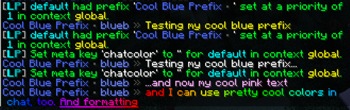
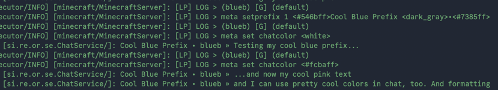

# OrchidChat

Simple and actually good Forge 1.20.1+ mod that lets you format your chat with [MiniMessage](https://docs.papermc.io/adventure/minimessage/)
and [LuckPerms meta](https://luckperms.net/wiki/Prefixes,-Suffixes-&-Meta).

LuckPerms required.

